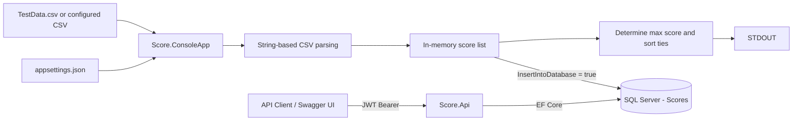
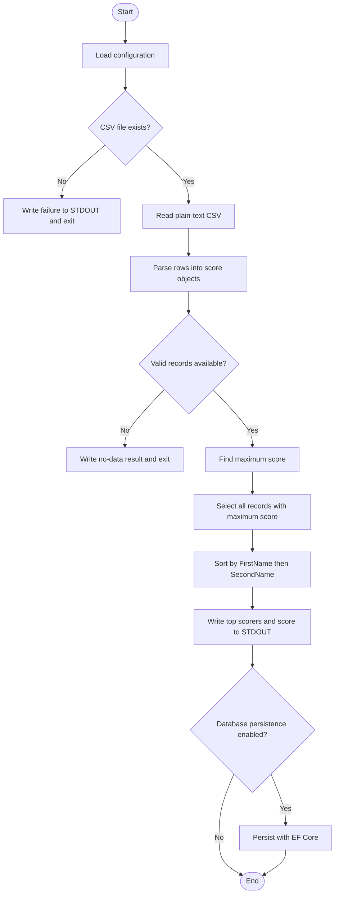
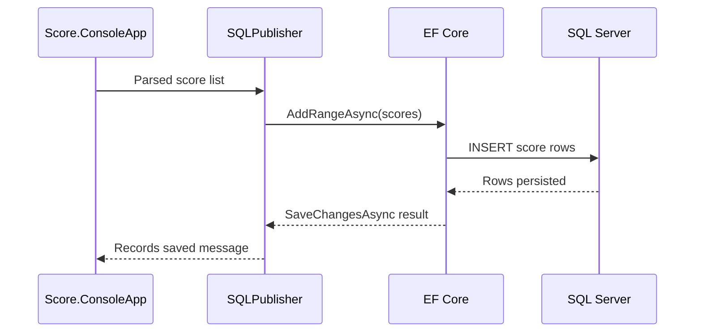
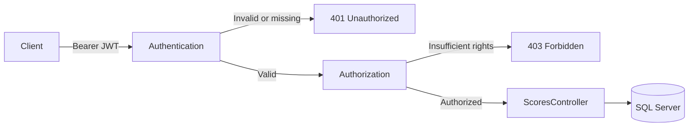

# Top Scorers - .NET 10 Reference Solution

## Overview

This repository presents my implementation of the **Top Scorers** solution requirements using **.NET 10**, **ASP.NET Core Web API**, **Entity Framework Core**, and **SQL Server**.

My objective was to deliver a solution that is small enough to understand quickly, while still demonstrating the engineering practices I consider important in production software: clear separation of responsibilities, external configuration, explicit validation, deterministic business logic, database persistence, secure API access, API discoverability, and documented architectural decisions.

The solution demonstrates the following capabilities:

- Reading score data from a configurable plain-text CSV file.
- Parsing the CSV content using built-in .NET file and string operations rather than a CSV parsing package.
- Determining the highest score and returning every person tied for that score.
- Ordering tied top scorers alphabetically by first name and then second name.
- Writing the imported score data to SQL Server through Entity Framework Core.
- Exposing stored scores through a secured ASP.NET Core REST API.
- Supporting name-based score lookup rather than relying solely on a database identifier.
- Protecting API endpoints with JWT Bearer authentication and policy-based authorization.
- Providing Swagger UI with JWT authorization for interactive API exploration.
- Externalising the CSV file location, SQL connection string, and database-write toggle into application configuration.
- Documenting an Azure-based cloud deployment approach for the API and a future user interface.

---

## Solution structure

```text
Score
|
|-- Score.ConsoleApp
|   |-- Data
|   |-- Migrations
|   |-- Models
|   |-- Services
|   |-- resources
|   |   `-- TestData.csv
|   |-- appsettings.json
|   `-- Program.cs
|
|-- Score.Api
|   |-- Controllers
|   |-- Data
|   |-- Dtos
|   |-- Models
|   |-- appsettings.json
|   |-- appsettings.Development.json
|   `-- Program.cs
|
|-- docs
|   |-- ARCHITECTURE.md
|   |-- CLOUD-HOSTING.md
|   |-- DESIGN-DECISIONS.md
|   |-- REQUIREMENTS-TRACEABILITY.md
|   |-- SECURITY.md
|   `-- SUBMISSION-EVIDENCE.md
|
`-- Score.slnx
```

---

## High-level architecture



The console application is responsible for ingesting and evaluating the source data. The API provides a separate HTTP interface over the persisted data. Both applications use the same logical `Scores` datastore.

This separation allows each capability to evolve independently. For example, the console importer could later become a scheduled worker or background job without requiring the API contract to change.

---

## Core processing flow



---

## Prerequisites

- .NET 10 SDK
- SQL Server, SQL Server Express, LocalDB, or another reachable SQL Server instance
- `dotnet-ef` if the included migration is used to create the database schema

Verify the installed SDK:

```bash
dotnet --version
```

Install the EF Core CLI if required:

```bash
dotnet tool install --global dotnet-ef --add-source https://api.nuget.org/v3/index.json --ignore-failed-sources
```

---

## Console application configuration

`Score.ConsoleApp/appsettings.json` contains the runtime values used by the importer:

```json
{
  "ConnectionStrings": {
    "ScoreDb": "<sql-server-connection-string>"
  },
  "CsvSettings": {
    "FilePath": "<full-path-to-TestData.csv>"
  },
  "DatabaseSettings": {
    "InsertIntoDatabase": true
  }
}
```

The `InsertIntoDatabase` switch allows me to run the scoring requirement independently from SQL Server when required:

```json
"InsertIntoDatabase": false
```

With the switch disabled, the application still reads, evaluates, sorts, and writes the result to STDOUT, but it does not attempt a database connection.

For a public repository, machine-specific paths and credentials should be replaced with safe local-development examples or moved into user secrets/environment variables.

---

## Running the console application

From the repository root:

```bash
dotnet run --project Score.ConsoleApp
```

The supplied example data is:

```csv
First Name,Second Name,Score
Dee,Moore,56
Sipho,Lolo,78
Noosrat,Hoosain,64
George,Of The Jungle,78
```

The relevant STDOUT result is:

```text
George Of The Jungle
Sipho Lolo
Score: 78
```

This demonstrates both required behaviours:

1. More than one person can share the highest score.
2. Tied top scorers are returned alphabetically.

---

## Database persistence

When database persistence is enabled, the parsed score records are written through Entity Framework Core.

The current database entity contains:

```text
Id
FirstName
SecondName
Score
```

`FirstName`, `SecondName`, and `Score` represent the source data. `Id` is an implementation-level surrogate key used to provide stable entity identity within EF Core and the relational model.

The persistence sequence is:



---

## Running the API

From the repository root:

```bash
dotnet run --project Score.Api
```

In Development, Swagger UI is available at:

```text
https://localhost:<port>/swagger
```

The exact development port is defined in `Score.Api/Properties/launchSettings.json`.

---

## API endpoints

| Method | Route | Purpose | Authorization |
|---|---|---|---|
| `GET` | `/api/scores` | Retrieve all stored scores | Authenticated user |
| `GET` | `/api/scores/search/{search}` | Search a person by first or second name | Authenticated user |
| `GET` | `/api/scores/highest` | Retrieve all top scorers in alphabetical order | Authenticated user |
| `POST` | `/api/scores` | Add a new score | `WriteScores` policy / `admin` role |

Example search requests:

```http
GET /api/scores/search/Sipho
```

```http
GET /api/scores/search/Jungle
```

The search is performed against both `FirstName` and `SecondName`. A search implementation can return all matching rows rather than assuming names are unique.

Example POST body:

```json
{
  "firstName": "Thabo",
  "secondName": "Mokoena",
  "score": 92
}
```

The API request DTO validates required names and constrains the score to the accepted range.

---

## API security

The API uses JWT Bearer authentication with a secure-by-default authorization model.



Authentication is required by default. Write operations are protected by a stronger policy requiring the `admin` role.

For local testing:

```bash
dotnet user-jwts create --project Score.Api
```

For an admin token:

```bash
dotnet user-jwts create --role admin --project Score.Api
```

Open Swagger UI, select **Authorize**, paste the generated JWT, and execute the secured endpoints.

Production authentication is documented in [Security](docs/SECURITY.md).

---

## Design principles demonstrated

I deliberately kept the solution compact while making the engineering intent visible:

- Configuration is externalised rather than hard-coded into runtime logic.
- CSV processing is implemented directly instead of delegated to a CSV library.
- Business logic for maximum score and ties is explicit and deterministic.
- Database persistence is separated from score calculation.
- HTTP request/response DTOs are separate from database entities.
- Read-only EF Core queries use `AsNoTracking()`.
- API data access is asynchronous.
- Authentication is required by default.
- Write access is stricter than read access.
- Swagger provides a reproducible way to demonstrate the secured API.
- Design assumptions and trade-offs are documented rather than hidden.

---

## Documentation set

- [Architecture](docs/ARCHITECTURE.md) - solution boundaries, request flows, persistence model, and Mermaid diagrams.
- [Requirements Traceability](docs/REQUIREMENTS-TRACEABILITY.md) - requirement-to-implementation evidence.
- [Design Decisions](docs/DESIGN-DECISIONS.md) - design rationale, assumptions, and trade-offs.
- [Security](docs/SECURITY.md) - JWT authentication, authorization policies, Swagger authorization, and production hardening.
- [Cloud Hosting](docs/CLOUD-HOSTING.md) - proposed Azure deployment for the API and a future UI.
- [Submission Evidence](docs/SUBMISSION-EVIDENCE.md) - concise narrative of the work completed and the engineering capabilities demonstrated.
- [Public Repository Checklist](docs/PUBLIC-REPOSITORY-CHECKLIST.md) - final sanitisation and verification steps before publishing.

---

## Scope and future evolution

This implementation is intentionally proportionate to the size of the problem. If I were evolving it beyond the exercise, my next priorities would be:

- Add automated unit and integration tests.
- Replace simple comma splitting with a small quoted-field-aware parser while still avoiding CSV libraries.
- Add structured logging and central Problem Details error handling.
- Define explicit duplicate-person/data rules.
- Move production authentication to Microsoft Entra ID.
- Move secrets to a managed secret store and use managed identity where possible.
- Add CI/CD and automated verification from a clean repository checkout.

The aim of the current implementation is not to maximise complexity, but to provide a clear, maintainable foundation that can be extended when requirements justify it.
