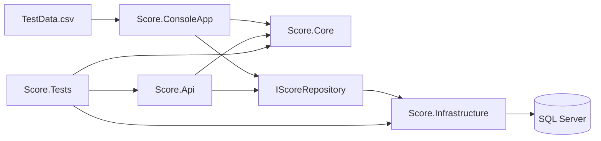

# Score — Top Scorers Solution

This repository contains a refactored .NET 10 implementation of the **Top Scorers** exercise. The design separates domain logic, infrastructure concerns, delivery mechanisms and automated tests so the solution can be run, maintained and evolved without duplicating business logic.

## Solution structure

```text
Score.sln
├── Score.Core                 domain model, custom CSV parser, repository contract
├── Score.Infrastructure       EF Core, SQL Server and repository implementation
├── Score.ConsoleApp           file → parse → write → query → STDOUT
├── Score.Api                  POST / GET by name / GET top, JWT + write policy
└── Score.Tests                parser, SQLite repository and API integration tests
```



## Key design choices

- **No CSV parsing library is used.** `ScoreCsvParser` parses CSV content from a `string` and handles quoted fields, embedded commas and escaped quotes.
- **Core has no EF Core or ASP.NET dependency.** Domain behavior can be tested without infrastructure.
- **Repository abstraction.** Both the console app and API use `IScoreRepository`; EF Core remains an infrastructure detail.
- **One EF Core model/context.** The previous duplication between console and API has been removed.
- **JWT Bearer authentication.** All API endpoints require authentication and POST additionally requires the `admin` role through the `WriteScores` policy.
- **Automated tests.** Parser/domain tests, repository tests using SQLite in-memory, and HTTP integration tests using `WebApplicationFactory` are included.

## Console application

Configuration lives in `Score.ConsoleApp/appsettings.json`:

```json
{
  "ConnectionStrings": {
    "ScoreDb": "Server=(localdb)\\MSSQLLocalDB;Database=ScoreDb;Trusted_Connection=True;TrustServerCertificate=True;"
  },
  "CsvSettings": {
    "FilePath": "resources/TestData.csv"
  },
  "DatabaseSettings": {
    "InsertIntoDatabase": true
  }
}
```

Run:

```powershell
dotnet run --project Score.ConsoleApp
```

Expected result for the supplied data:

```text
George Of The Jungle
Sipho Lolo
Score: 78
```

If database persistence is enabled an additional persistence confirmation is written after the required result.

## Database

The EF migration is owned by `Score.Infrastructure`.

Apply it using either executable project as the startup project. For example:

```powershell
dotnet ef database update --project Score.Infrastructure --startup-project Score.Api
```

To add a future migration:

```powershell
dotnet ef migrations add <MigrationName> --project Score.Infrastructure --startup-project Score.Api
```

## REST API

Run:

```powershell
dotnet run --project Score.Api
```

Development Swagger UI opens at:

```text
https://localhost:7181/swagger
```

Endpoints:

| Method | Endpoint | Purpose | Authorization |
|---|---|---|---|
| POST | `/api/scores` | Save a new score | authenticated + `admin` role |
| GET | `/api/scores/by-name?firstName=...&secondName=...` | Retrieve a specific person's score record(s) | authenticated |
| GET | `/api/scores/top` | Retrieve all top scorers alphabetically | authenticated |

### Local JWT testing

Create a normal development token:

```powershell
dotnet user-jwts create --project Score.Api
```

Create an admin token for POST:

```powershell
dotnet user-jwts create --role admin --project Score.Api
```

Paste the token into Swagger's **Authorize** dialog. Because the Swagger scheme is HTTP Bearer, paste the token itself rather than prefixing it with `Bearer`.

## Tests

Run all tests:

```powershell
dotnet test
```

Coverage includes:

- parsing supplied CSV structure;
- quoted fields and escaped quotes;
- invalid-score handling;
- tied top scorers in alphabetical order;
- EF repository behavior on relational SQLite in-memory;
- unauthenticated API rejection;
- GET by name;
- write-policy rejection without `admin`;
- successful POST with `admin`.

See [Architecture](docs/ARCHITECTURE.md), [Security](docs/SECURITY.md) and [Testing](docs/TESTING.md) for additional implementation evidence.
