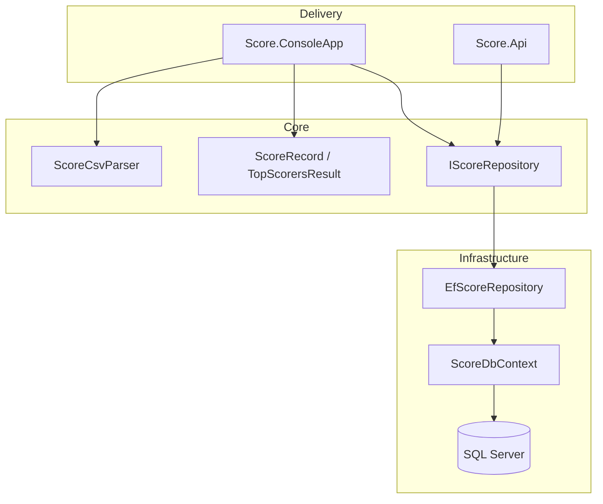
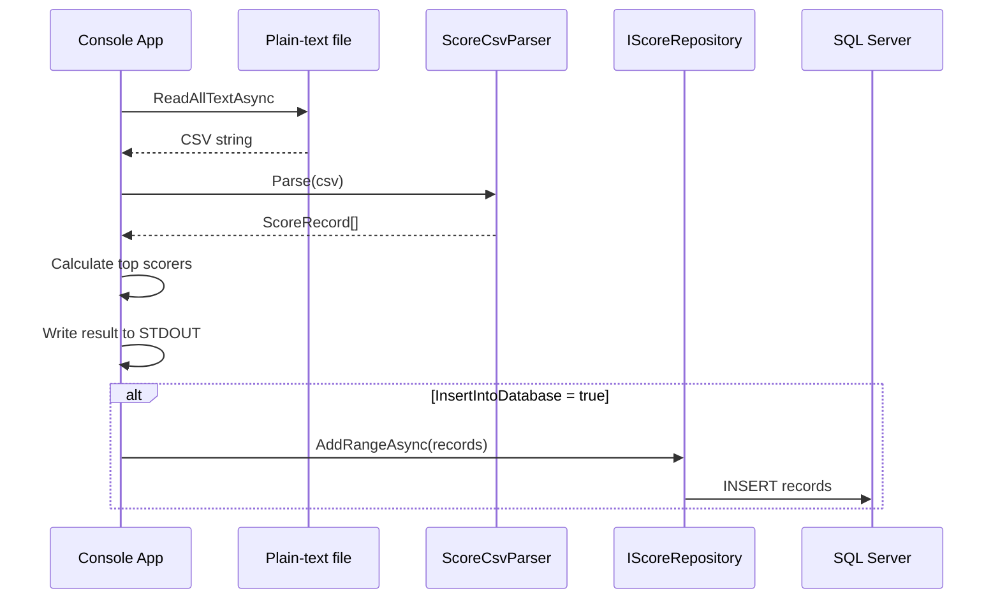
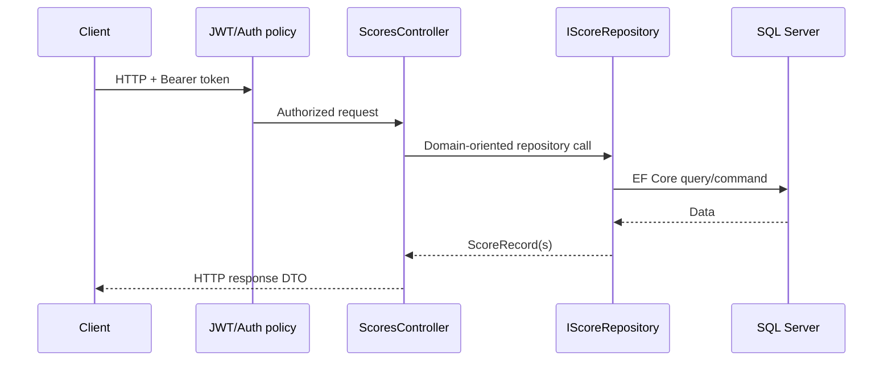

# Architecture

## Design objective

The solution separates business rules from frameworks and transport concerns. `Score.Core` owns the score model, custom CSV parsing, top-scorer calculation and repository contract. EF Core/SQL Server is isolated in `Score.Infrastructure`, while the console app and REST API are independent delivery mechanisms.

## Console flow

## API flow

