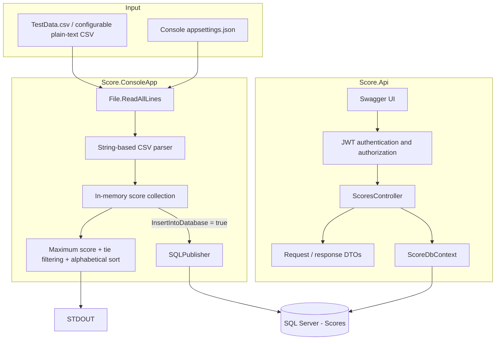
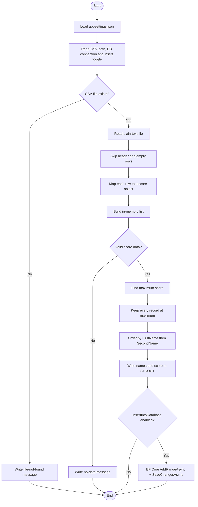
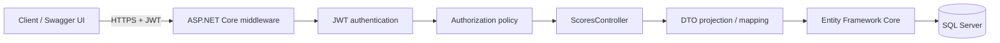
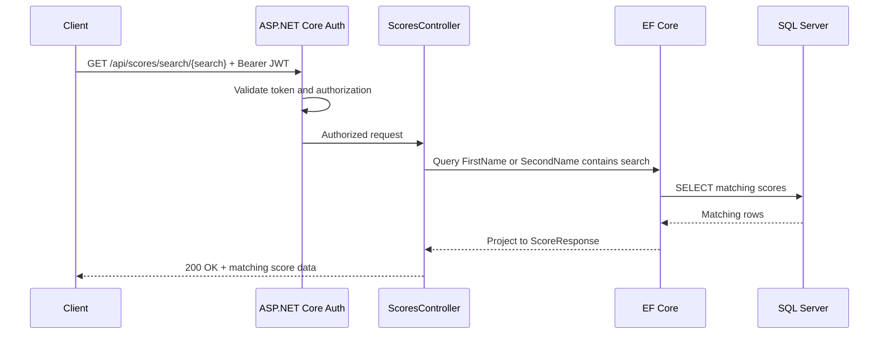
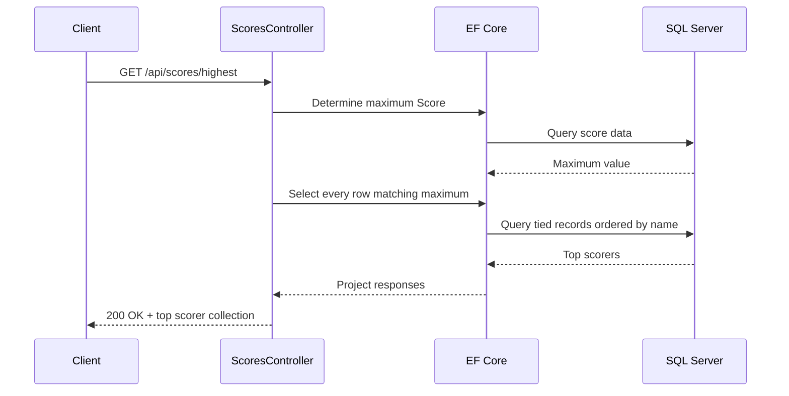
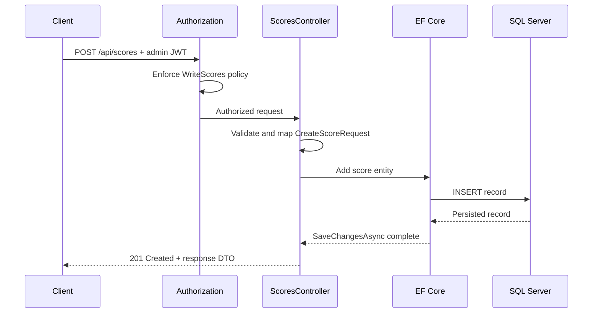
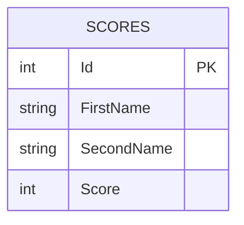

# Solution Architecture

## Purpose

This document describes the architecture I implemented for the Top Scorers solution and explains how the main responsibilities are separated across file ingestion, business logic, persistence, and API access.

The solution contains two executable .NET 10 applications:

1. `Score.ConsoleApp` - responsible for file ingestion, score evaluation, STDOUT output, and optional database publication.
2. `Score.Api` - responsible for secured HTTP access to the stored score data.

Both applications use the same logical SQL Server datastore.

---

## Component architecture

---

## Console application flow

The console application executes the core scoring requirement independently from the API.

### Why this design

I kept the scoring logic in the console process because the file-processing program is a distinct requirement. Database persistence is an optional secondary action rather than a prerequisite for calculating the result. This allows the core behaviour to be exercised even when SQL Server is not available.

---

## API architecture

The API exposes stored scores through authenticated REST endpoints.

The API boundary is separated from the persistence model through request and response DTOs. This prevents database-specific fields from becoming the write contract and provides a clear place for validation.

---

## API endpoint flow

### Search by person name

The string-based search is intentionally aligned to the concept of locating a person by name rather than requiring the caller to know an internal database identifier.

### Highest-score lookup

### Score creation

---

## Data model

The three business data fields originate from the CSV input. `Id` is a surrogate database key introduced to provide stable relational/EF identity without treating a person's name as guaranteed unique.

---

## Responsibility boundaries

### `Score.ConsoleApp`

I assigned the following responsibilities to the console application:

- Load runtime configuration.
- Resolve the input file location.
- Read the plain-text input.
- Parse CSV row values without a CSV package.
- Build the in-memory score collection.
- Determine the highest score.
- Preserve every tie.
- Alphabetically order tied top scorers.
- Write the required result to STDOUT.
- Optionally publish the imported data to SQL Server.

### `Score.Api`

I assigned the following responsibilities to the API:

- Authenticate callers using JWT Bearer authentication.
- Apply authorization rules before controller execution.
- Validate POST request payloads.
- Expose score retrieval and creation operations.
- Search score data by first or second name.
- Retrieve all highest-scoring records.
- Separate HTTP DTOs from EF Core entities.
- Expose secured Swagger UI for development-time exploration.

### SQL Server

SQL Server is the shared persistence layer between the file-ingestion path and API path. Entity Framework Core provides the database abstraction and migration support.

---

## Architectural qualities demonstrated

### Maintainability

Each project has a focused responsibility, and configuration values are externalised from business logic.

### Evolvability

The file importer can later move to a scheduled service, Azure Function, Container Apps Job, or worker service without changing the API contract.

### Security

Authentication is required by default, with more restrictive authorization applied to data mutation.

### Testability

The business rules are explicit and small enough to isolate into unit-tested services as the solution evolves.

### Operational simplicity

The solution does not introduce unnecessary infrastructure. It uses managed framework capabilities and a conventional relational database that can move directly from local SQL Server to Azure SQL.
