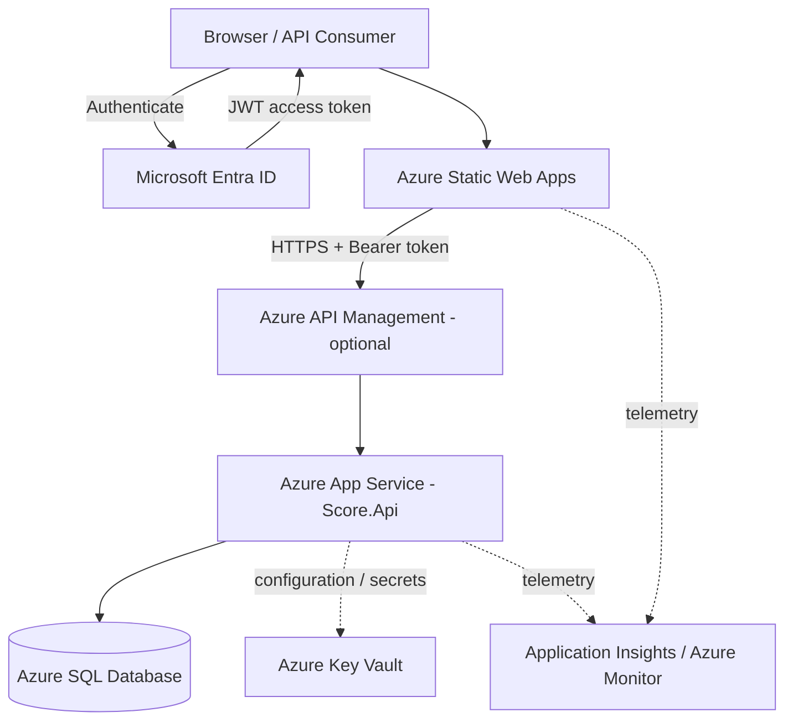
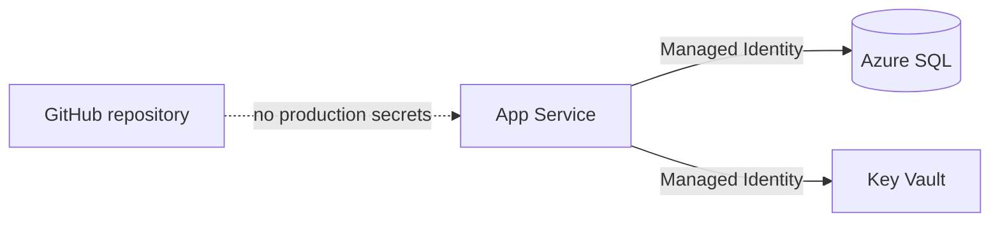
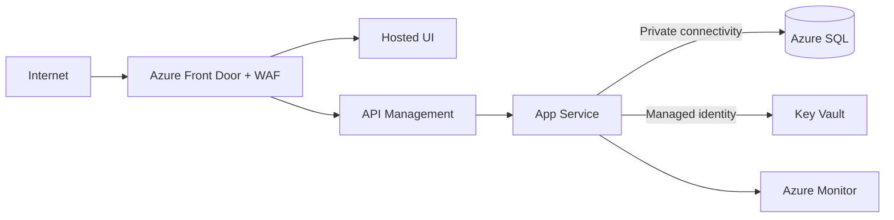

# Cloud Hosting Proposal

## Objective

If this solution were promoted from local development into a hosted application with a user interface, I would use a managed Azure architecture that preserves the current .NET and SQL technology choices while minimising operational overhead.

My preferred starting point is:

- **Azure App Service** for the ASP.NET Core API.
- **Azure SQL Database** for persistence.
- **Microsoft Entra ID** for production authentication and authorization.
- **Azure Static Web Apps** for a SPA-style frontend, or a second App Service for a server-rendered ASP.NET Core UI.
- **Azure Key Vault** for secrets/certificates where secrets remain necessary.
- **Application Insights / Azure Monitor** for telemetry.
- **Azure API Management** only when API governance requirements justify it.

---

## Proposed Azure architecture



For a small internal deployment, I would initially remove API Management from the request path and allow the UI to call the API directly. APIM becomes valuable when there are multiple consumers, external exposure, rate limits, quotas, transformation policies, or broader lifecycle governance requirements.

---

## Azure App Service for the API

I would start with App Service because the API is a conventional ASP.NET Core application and does not require Kubernetes-level orchestration.

### Reasons

- Native ASP.NET Core hosting.
- Managed TLS/HTTPS support.
- Deployment slots.
- Straightforward horizontal/vertical scaling.
- Managed identity integration.
- VNet integration options.
- Low operational overhead compared with VMs or AKS.

### Alternative

I would choose **Azure Container Apps** instead if the wider platform standardised on containers, revision-based deployments, multiple microservices, or event-driven background jobs.

---

## Azure SQL Database

Azure SQL is the most direct cloud persistence target because the solution already uses SQL Server and the EF Core SQL Server provider.

Benefits include:

- Minimal application changes.
- Managed backups and patching.
- High-availability options.
- Point-in-time restore.
- Elastic scaling choices.
- Private networking capabilities.

I would begin with a small service tier appropriate to the workload and scale from observed telemetry rather than anticipated complexity.

---

## Microsoft Entra ID

Local development JWT generation would be replaced by Microsoft Entra ID in production.

I would configure:

- An app registration for the API.
- An app registration/client configuration for the UI or consuming application.
- API scopes and/or application roles.
- An application role corresponding to score-write access.

The current authorization model maps naturally to:

```text
Authenticated user     -> read score data
Score.Writer / admin   -> create score data
```

---

## User interface hosting

### SPA frontend

For React, Angular, Vue, or Blazor WebAssembly, I would use **Azure Static Web Apps** because it provides:

- Static hosting.
- Global distribution.
- Managed TLS.
- GitHub-integrated deployment.
- Low operating overhead.

### Server-rendered ASP.NET Core UI

If the UI required server-side rendering or substantial server-side application logic, I would use a second App Service.

---

## Key Vault and managed identity

Where possible, I would avoid database passwords entirely and use managed identity.

Where secrets are still required, they would be stored in Azure Key Vault rather than `appsettings.json`.



---

## Observability

Application Insights and Azure Monitor would provide:

- Request duration and failure rate.
- Dependency timing for SQL calls.
- Exceptions.
- Structured application traces.
- Availability monitoring.
- Operational dashboards and alerting.

I would use telemetry to drive scaling and performance decisions rather than adding infrastructure pre-emptively.

---

## Production network hardening

For a higher-security environment, I would evolve the architecture to:



The following controls would be considered based on the actual threat model:

- Front Door/WAF.
- Private endpoints.
- VNet integration.
- Restricted public database access.
- API Management policies.
- IP restrictions.
- Managed identity.
- Defender/monitoring controls.

I would not introduce all of these automatically for a small low-risk application; the security architecture should be proportional to the exposure and data classification.

---

## CI/CD proposal

Because the code is intended for GitHub, I would use GitHub Actions with workload identity federation to Azure.


Repository controls would include:

- Protected default branch.
- Pull requests for change integration.
- Required build/test checks.
- Secret scanning.
- Dependency scanning.
- Environment approval for production deployment.
- OIDC/workload identity rather than long-lived Azure deployment credentials.

---

## Scaling approach

The API is stateless, so horizontal scaling is straightforward. SQL remains the shared source of truth.

My scaling strategy would be:

1. Deploy on the smallest tier that meets availability requirements.
2. Capture real telemetry.
3. Identify whether pressure is API, SQL, or network related.
4. Tune queries/indexes before scaling blindly.
5. Scale App Service horizontally when request concurrency requires it.
6. Scale Azure SQL only when database metrics justify it.

This keeps the cloud design cost-conscious while retaining a clear path to enterprise hardening.
