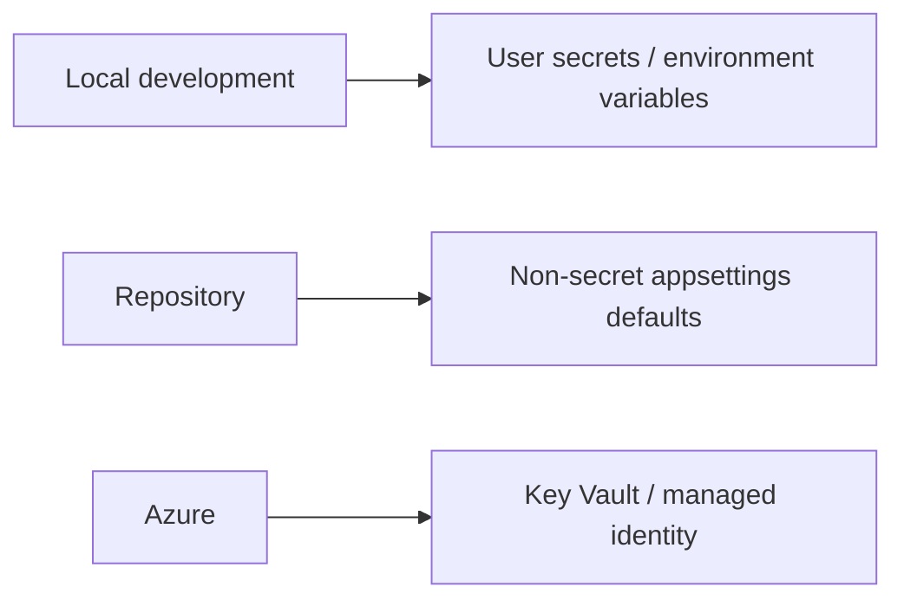

# Design Decisions and Assumptions

## Purpose

This document records the decisions I made while implementing the solution, including the trade-offs behind them. The intention is to make the engineering reasoning visible alongside the code rather than present the implementation as a set of unexplained technical choices.

---

## 1. Separate console and API projects

I implemented the solution as two executable projects:

- `Score.ConsoleApp`
- `Score.Api`

The console application owns file ingestion and score calculation. The API owns HTTP access to persisted data.

This separation reflects the different execution models and keeps each application focused. It also leaves room to evolve the importer independently into a scheduled process, background worker, or cloud job.

---

## 2. External configuration instead of hard-coded runtime values

I moved the following values into `appsettings.json`:

- CSV file location.
- SQL Server connection string.
- Database-write toggle.

This allows the same compiled application to run in different environments without source-code changes.

Example:

```json
{
  "ConnectionStrings": {
    "ScoreDb": "<connection-string>"
  },
  "CsvSettings": {
    "FilePath": "<csv-path>"
  },
  "DatabaseSettings": {
    "InsertIntoDatabase": true
  }
}
```

---

## 3. Application-owned CSV parsing

I did not use a CSV parsing library. The file is read as plain text and rows are processed using built-in .NET string operations.

This makes the parsing behaviour visible in the solution and satisfies the requirement that parsing be implemented rather than delegated to a package.

### Current assumption

The implementation targets a simple three-column CSV format in which field values do not contain embedded commas, escaped quotes, or multiline values.

For a broader input contract, I would retain the no-library approach but replace `Split(',')` with a small character-by-character state machine.

---

## 4. In-memory processing for the current data size

The console application uses `File.ReadAllLines()` and an in-memory list because the supplied dataset is small and clarity is more valuable than premature optimisation.

For large files, I would evolve the implementation to:

- Use `StreamReader` to process records incrementally.
- Track the maximum score without loading the full input solely for scoring.
- Batch database writes.
- Add per-row error diagnostics.

I chose not to introduce those optimisations without an input-volume requirement.

---

## 5. LINQ for top-score selection

The business rule maps directly to LINQ:

1. Determine the maximum score.
2. Select all records with that score.
3. Sort by first name.
4. Then sort by second name.

Conceptually:

```csharp
var highestScore = scores.Max(x => x.Score);

var highestScorers = scores
    .Where(x => x.Score == highestScore)
    .OrderBy(x => x.FirstName)
    .ThenBy(x => x.SecondName)
    .ToList();
```

This is concise while remaining easy to verify against the business rule.

---

## 6. Database persistence can be switched off

The `InsertIntoDatabase` setting allows the file-processing requirement to be executed without requiring SQL Server.

This creates a useful separation between:

```text
Core requirement: read -> calculate -> output
Optional persistence path: parsed records -> SQL Server
```

It also reduces friction when validating only the scoring behaviour.

---

## 7. EF Core with SQL Server

I selected Entity Framework Core because the solution is .NET-based and EF Core provides:

- A small persistence surface.
- Async data-access APIs.
- LINQ query translation.
- Reproducible database migrations.
- A straightforward path from local SQL Server to Azure SQL.

The persistence layer remains simple enough to replace if the data-access requirements change later.

---

## 8. Surrogate database key

The database entity includes an identity `Id` even though the source CSV contains only:

- `FirstName`
- `SecondName`
- `Score`

I added the surrogate key because names are not guaranteed to be unique and the persistence model benefits from a stable row identity.

I do not use that internal key as the only way to locate a person through the API. The person lookup is name-based, which keeps internal persistence identity separate from the user-facing search semantics.

---

## 9. Name-based search for the person lookup

I changed the person lookup from a numeric database-key lookup to a string search:

```text
GET /api/scores/search/{search}
```

The search compares the supplied value against both `FirstName` and `SecondName`.

This decision better aligns the HTTP operation with the domain concept of finding a person. It also avoids forcing an API caller to know a database-generated identifier.

### Search result design

Because names are not unique, the search should be capable of returning multiple matching records. A search term such as `John` may legitimately match more than one person.

For a larger production domain, I would introduce a stable business identifier for exact person retrieval and preserve name search as a discovery endpoint.

---

## 10. DTOs separated from EF entities

The API uses dedicated request and response DTOs rather than exposing the EF entity directly.

Benefits include:

- Clients cannot supply persistence-only fields during POST.
- Validation remains at the HTTP boundary.
- Database schema changes do not automatically become API contract changes.
- Mapping intent is explicit.

---

## 11. Request validation

The POST contract validates required names and constrains score values to an accepted range.

This prevents obviously invalid data from reaching the persistence layer and makes the API contract self-describing through Swagger/OpenAPI.

---

## 12. `AsNoTracking()` for read-only queries

GET endpoints use `AsNoTracking()` where entities are not modified.

This communicates read-only intent and avoids unnecessary EF Core change-tracking overhead.

---

## 13. Async API data access

The API uses asynchronous EF Core operations such as `ToListAsync()`, `FirstOrDefaultAsync()`, `MaxAsync()`, and `SaveChangesAsync()`.

This is appropriate for I/O-bound database work in ASP.NET Core and avoids tying up request threads while waiting on database operations.

---

## 14. Secure-by-default authorization

The API uses a fallback policy requiring authentication. Write access is further restricted through the `WriteScores` policy requiring the `admin` role.

I chose this model because it makes security the default state rather than something that has to be remembered on every future endpoint.

```text
Default: authenticated caller required
POST: authenticated caller + admin role required
```

---

## 15. Swagger as executable API documentation

Swagger UI is available in Development and configured with JWT Bearer authorization.

This gives a reviewer or developer a direct way to:

- Inspect the API contract.
- Authenticate through the **Authorize** button.
- Execute secured GET and POST requests.
- Observe response codes and payloads.

I keep interactive documentation out of the production path by default unless there is an explicit requirement to expose and secure it.

---

## 16. Configuration and secrets strategy

For a public repository, source-controlled configuration should contain only non-sensitive examples.

My target configuration model is:



Production credentials and tokens should never be committed to Git.

---

## 17. Error handling scope

The current solution uses simple validation and normal ASP.NET Core response handling to remain proportionate to the problem size.

If the system grew beyond the exercise, I would add:

- Central Problem Details exception handling.
- Structured logging.
- Correlation IDs.
- Database transient-fault handling where appropriate.
- Rich CSV row-validation diagnostics.
- Duplicate-record rules.
- Health checks and operational telemetry.

---

## 18. Principle applied throughout

My general design principle for this solution was:

> Use enough structure to make the code clear, secure, maintainable, and extensible, but do not introduce infrastructure or abstraction that the current problem does not justify.
