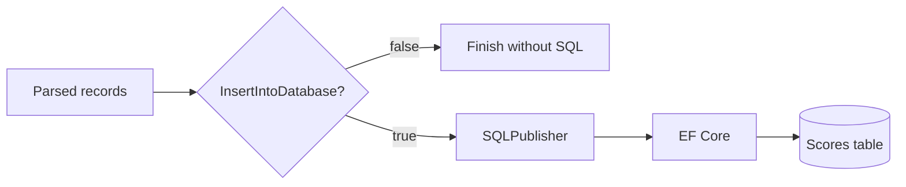
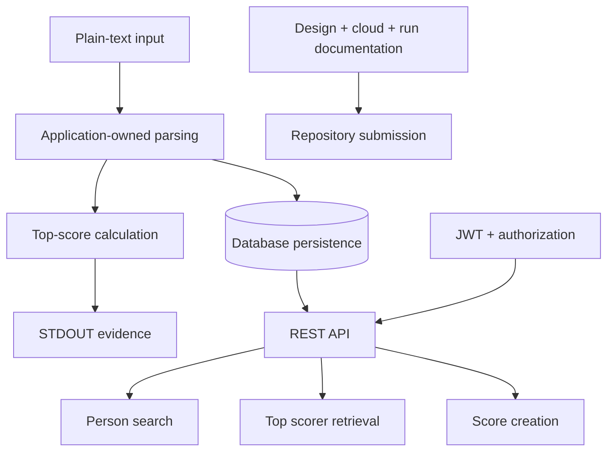

# Requirements Traceability and Evidence

## Purpose

This document provides direct traceability between the requested capabilities and the implementation evidence contained in the solution. I use it to make the scope, assumptions, and engineering decisions explicit rather than relying on implicit interpretation of the codebase.

---

## Traceability matrix

| Requirement | Implementation evidence | Coverage |
|---|---|---|
| Accept score data from a plain-text CSV file | `Score.ConsoleApp` reads `CsvSettings:FilePath` and loads the file using built-in .NET file APIs | Implemented |
| Parse CSV without a standard CSV parsing library | Rows are parsed with application-owned string processing; no CSV parsing package is used | Implemented for the simple CSV format used by the exercise |
| Output the top scorer(s) and highest mark | The console application determines `Max(Score)`, selects all matching records, and writes the result to STDOUT | Implemented |
| Return every tied top scorer alphabetically | Tied records are ordered by `FirstName`, then `SecondName` | Implemented |
| Support STDOUT output | Result and execution messages use `Console.WriteLine(...)` | Implemented |
| Provide an example using the supplied test data | `Score.ConsoleApp/resources/TestData.csv` and the expected output are documented in the root README | Implemented |
| Work with input beyond the supplied sample | File path and scoring logic are data-driven and configurable | Implemented within the documented simple-CSV assumptions |
| Write imported data to a database table | `SQLPublisher` persists the parsed score list with EF Core | Implemented |
| Persist the CSV business columns | `FirstName`, `SecondName`, and `Score` are stored in the `Scores` table | Implemented |
| Provide a REST POST endpoint to add scores | `POST /api/scores` accepts `CreateScoreRequest`, maps it to the persistence entity, and calls `SaveChangesAsync()` | Implemented |
| Provide a GET capability for a specific person | `GET /api/scores/search/{search}` searches `FirstName` or `SecondName` using the supplied string | Implemented as a name-based lookup |
| Provide a GET endpoint for top score(s) | `GET /api/scores/highest` returns all records sharing the maximum score and orders them alphabetically | Implemented |
| Demonstrate endpoint security | JWT Bearer authentication, authenticated-user fallback policy, `WriteScores` admin policy, and Swagger JWT authorization | Implemented |
| Explain cloud components for hosted API and UI | Azure deployment proposal is documented in `CLOUD-HOSTING.md` | Documented proposal |
| Explain design choices and assumptions | `DESIGN-DECISIONS.md`, `ARCHITECTURE.md`, and this document provide rationale | Implemented |
| Provide run instructions | Root `README.md` contains prerequisites, configuration, console/API run steps, and JWT testing | Implemented |
| Prepare the work for version-controlled publication | Repository structure and public-repository checklist are included | Prepared for GitHub publication |

---

## Evidence: supplied dataset

Input:

```csv
First Name,Second Name,Score
Dee,Moore,56
Sipho,Lolo,78
Noosrat,Hoosain,64
George,Of The Jungle,78
```

Expected business result:

```text
George Of The Jungle
Sipho Lolo
Score: 78
```

The implementation first determines the maximum score (`78`), then selects every record with that score, and finally orders the tied records alphabetically.

---

## Evidence: core scoring logic

The core decision process is intentionally direct:


This approach avoids ranking every record when the requirement only needs the top score and tied winners.

---

## Evidence: database persistence

The console application can be configured to persist the imported records after evaluating them.



The database persistence switch is configuration-driven, which lets the core file-processing behaviour run independently of database availability.

---

## Evidence: person lookup

The API provides a string-based search route:

```text
GET /api/scores/search/{search}
```

The search term is matched against both first name and second name. This design better represents a caller searching for a person than requiring knowledge of an internal numeric key.

Conceptually:

```csharp
.Where(x =>
    x.FirstName.Contains(search) ||
    x.SecondName.Contains(search))
```

Where more than one record matches the search term, returning a collection is preferable because names are not unique identifiers.

---

## Evidence: highest-score API behaviour

The highest-score endpoint preserves the same rule as the console application:

```text
GET /api/scores/highest
```

Its logic is:

1. Determine the maximum stored `Score`.
2. Retrieve all rows with that score.
3. Order by `FirstName`.
4. Then order by `SecondName`.
5. Return the full collection.

This ensures the API and console application apply a consistent business rule.

---

## Design assumptions and documented trade-offs

### CSV grammar

I deliberately did not introduce a third-party CSV library. The current implementation is aimed at the simple three-column format used by the exercise.

A plain `Split(',')` approach does not represent the complete CSV specification. For broader CSV support while retaining the no-library constraint, I would replace it with a small state-machine parser capable of handling quoted fields, escaped quotes, and embedded commas.

Example requiring that enhancement:

```csv
George,"Of The Jungle, Cape Town",78
```

### Surrogate database key

The database includes an `Id` column in addition to the three source business fields. I introduced it as a persistence-level surrogate key because a person's name is not guaranteed to be unique and EF Core entities benefit from a stable key.

The application does not require clients to know that key for person search; the user-facing lookup is name-based.

### Search semantics

The name search is deliberately a search operation rather than a claim that names uniquely identify people. For a production domain with a true person identifier, I would introduce a stable business identifier and use name search only as a discovery feature.

### Automated testing

The current implementation demonstrates the required behaviour through executable code and the supplied data. A production-ready evolution should add automated tests for parsing, scoring, ties, sorting, API authorization, persistence, and search behaviour.

---

## Requirement coverage summary



The resulting solution demonstrates the complete end-to-end path from source-file ingestion to secured API access, while preserving explicit documentation of the assumptions made in the implementation.
