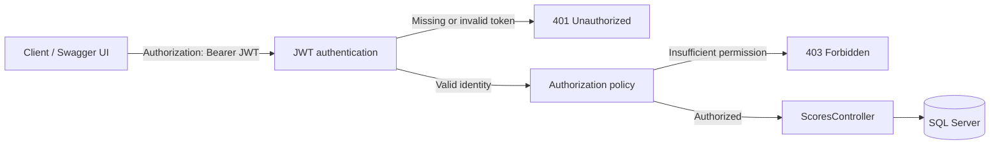
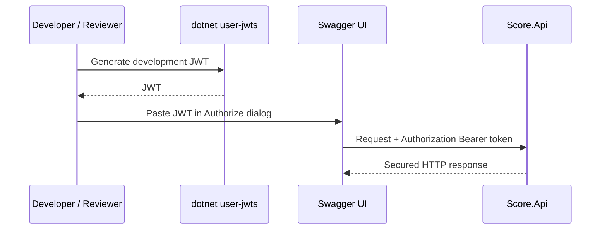
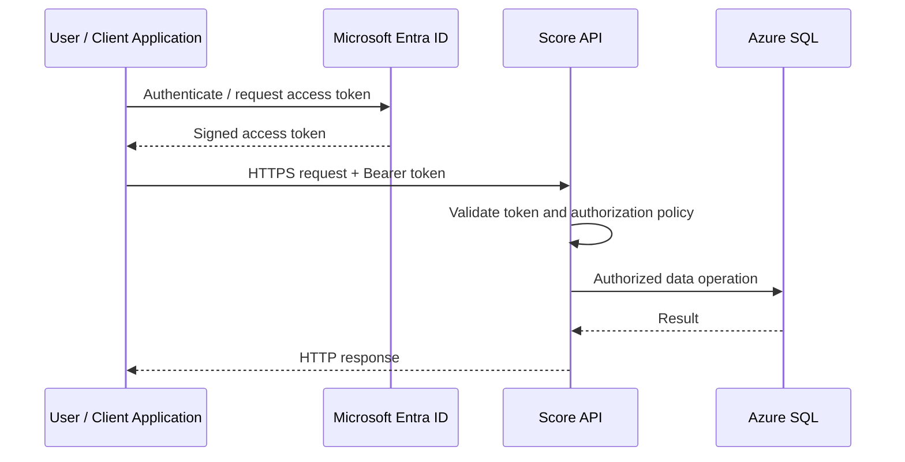

# API Security Design

## Security objective

I designed the API so that access is authenticated by default and write operations require stronger authorization than read operations.

The current implementation uses:

- JWT Bearer authentication.
- ASP.NET Core authorization policies.
- A fallback policy requiring authenticated callers.
- An additional `WriteScores` policy requiring the `admin` role.
- Swagger UI configured with an HTTP Bearer security definition for development-time testing.

---

## Request security flow



This separates two concerns:

- **Authentication** establishes who the caller is.
- **Authorization** determines what that caller is permitted to do.

---

## Default-deny authorization

I use an authenticated-user fallback policy rather than protecting endpoints one by one only.

The intended access model is:

```text
All API endpoints       -> authenticated caller required
POST /api/scores        -> authenticated caller + admin role required
```

This reduces the chance of a future endpoint being unintentionally exposed because an `[Authorize]` attribute was forgotten.

---

## Endpoint authorization model

| Endpoint | Access requirement |
|---|---|
| `GET /api/scores` | Authenticated user |
| `GET /api/scores/search/{search}` | Authenticated user |
| `GET /api/scores/highest` | Authenticated user |
| `POST /api/scores` | Authenticated user satisfying `WriteScores` / `admin` role |

---

## Swagger JWT authorization

Swagger UI is enabled in the Development environment and includes an HTTP Bearer security scheme.

This exposes an **Authorize** button that accepts a JWT and applies it to subsequent requests.



Create a standard development token:

```bash
dotnet user-jwts create --project Score.Api
```

Create an admin token for POST testing:

```bash
dotnet user-jwts create --role admin --project Score.Api
```

Only the JWT value needs to be pasted into the Swagger authorization dialog when the OpenAPI scheme is configured as HTTP Bearer.

---

## Expected HTTP security behaviour

| Situation | Expected response |
|---|---|
| No JWT or invalid JWT | `401 Unauthorized` |
| Valid JWT but caller lacks required write role | `403 Forbidden` |
| Authorized successful GET | `200 OK` |
| Authorized successful POST | `201 Created` |

This distinction is important because `401` represents failure to establish a valid authenticated identity, while `403` represents an authenticated caller who lacks permission for the requested operation.

---

## Development versus production identity

`dotnet user-jwts` is used only to make local secured testing straightforward. It is not the production identity design.

For production, I would use **Microsoft Entra ID** as the identity provider.



The API should validate at least:

- Signature.
- Token issuer.
- Audience.
- Expiration.
- Required scopes or application roles.

The current `WriteScores` concept can map naturally to an Entra application role such as `Score.Writer`.

---

## Production hardening proposal

For a hosted version, I would apply the following controls:

- HTTPS-only access.
- Microsoft Entra ID as the token issuer.
- Least-privilege authorization policies.
- Managed identity where possible.
- Secrets stored in Azure Key Vault rather than source-controlled configuration.
- Restricted CORS origins.
- Request-size and rate limits where appropriate.
- Structured security/audit logging without logging JWT values.
- Application Insights and Azure Monitor telemetry.
- Database firewall/private connectivity according to the deployment threat model.
- Swagger disabled in production or exposed only through deliberate, secured access.
- Dependency and secret scanning in CI/CD.
- API Management when external consumption requires central throttling, quotas, policies, or API lifecycle governance.

---

## Security design principle

The security model is intentionally layered:

```text
HTTPS
  -> JWT authentication
      -> default authenticated-user policy
          -> operation-specific authorization
              -> validated controller request
                  -> least-privilege data access
```

This keeps endpoint security explicit while leaving a clear path from local development authentication to enterprise cloud identity.
