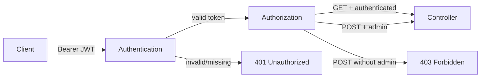

# API Security

The API uses JWT Bearer authentication and authorization policies.

- A fallback policy requires every endpoint to be authenticated.
- `GET /api/scores/by-name` requires an authenticated principal.
- `GET /api/scores/top` requires an authenticated principal.
- `POST /api/scores` additionally requires the `admin` role through the `WriteScores` policy.
- Swagger declares an HTTP Bearer scheme so authenticated requests can be exercised interactively during development.

For a cloud deployment, the intended evolution is to delegate token issuance to an identity provider such as Microsoft Entra ID. The API remains responsible for validating issuer, audience, signature and expiry and for enforcing authorization policy.
