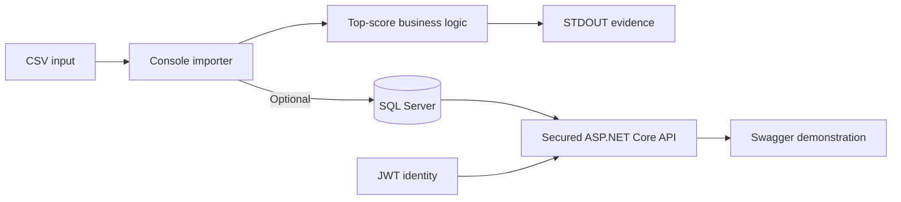

# Implementation Submission and Evidence

## Solution statement

I designed and implemented this solution as an end-to-end demonstration of file processing, business-rule implementation, relational persistence, REST API design, and API security using the modern .NET stack.

The implementation is intentionally compact, but the structure is designed to show how I approach software that must be understandable, maintainable, secure, and able to evolve beyond its first use case.

---

## What I delivered

### 1. Plain-text score ingestion

I implemented a console application that reads a configurable CSV file from disk without introducing a CSV parsing package.

The application maps each valid row into an in-memory score object containing:

```text
FirstName
SecondName
Score
```

This keeps the parsing logic visible and owned by the application.

### 2. Top-scorer calculation

I implemented the scoring rule by:

1. Determining the maximum score.
2. Selecting every person who achieved that score.
3. Sorting tied people by first name and then second name.
4. Writing the result to STDOUT.

For the supplied sample, the result is:

```text
George Of The Jungle
Sipho Lolo
Score: 78
```

### 3. Configurable execution

I externalised operational settings into configuration:

- CSV file path.
- SQL connection string.
- Database persistence toggle.

This allows the same executable to run against different files/environments without recompilation.

### 4. Database persistence

I implemented EF Core persistence to SQL Server and included migrations for schema management.

The console application can persist the imported dataset after calculating the result, or skip persistence entirely when the configuration toggle is disabled.

### 5. REST API

I created a separate ASP.NET Core Web API project over the stored score data.

The API supports:

```text
GET  /api/scores
GET  /api/scores/search/{search}
GET  /api/scores/highest
POST /api/scores
```

The person-search route searches both first and second names so a consumer does not need to know an internal database key.

### 6. API contract separation

I separated API request/response DTOs from EF Core persistence entities.

This keeps persistence concerns from leaking directly into the public HTTP contract and gives request validation an explicit boundary.

### 7. API security

I implemented JWT Bearer authentication and policy-based authorization.

The access model is:

```text
Read operations  -> authenticated caller
Write operation  -> authenticated caller + admin role
```

A fallback authorization policy protects endpoints by default.

### 8. Swagger/OpenAPI experience

I configured Swagger UI with JWT Bearer support so the secured API can be explored interactively in Development.

This provides an executable demonstration of:

- Authorized GET requests.
- Authorized POST requests.
- `401 Unauthorized` behaviour.
- `403 Forbidden` behaviour.
- Request and response contracts.

### 9. Cloud architecture proposal

I documented how I would host the solution in Azure using managed services, including:

- Azure App Service.
- Azure SQL Database.
- Microsoft Entra ID.
- Azure Static Web Apps or App Service for the UI.
- Key Vault.
- Application Insights / Azure Monitor.
- Optional API Management.

---

## End-to-end evidence



This demonstrates the full path from input ingestion through persistent storage to secured programmatic access.

---

## Engineering capabilities demonstrated

### C# / .NET

- .NET 10 console application.
- LINQ-based business rules.
- Async database operations.
- Strongly typed classes and DTOs.
- External configuration.

### ASP.NET Core

- Controller-based REST API.
- Attribute routing.
- Request validation.
- Dependency injection.
- JWT Bearer authentication.
- Policy/role-based authorization.
- Swagger/OpenAPI integration.

### Data access

- Entity Framework Core.
- SQL Server provider.
- Migrations.
- `AsNoTracking()` for read-only queries.
- Async query and persistence operations.

### Architecture

- Separation between importer and API.
- Separation between DTOs and persistence entities.
- Configurable database publication.
- Explicit responsibility boundaries.
- Cloud migration path without unnecessary rewrite.

### Security

- Secure-by-default endpoint policy.
- Differentiated read/write authorization.
- Local JWT testing strategy.
- Production identity proposal using Microsoft Entra ID.
- Secret-management and managed-identity strategy.

### Documentation

- Architecture diagrams.
- Requirement traceability.
- Design-decision record.
- Security design.
- Cloud deployment proposal.
- GitHub run instructions and repository preparation guidance.

---

## Key trade-offs I made

### Simple CSV parser

I chose a direct parser appropriate to the supplied three-column input rather than implementing the entire CSV grammar unnecessarily.

I have explicitly documented that quoted commas and escaped quotes would require a small state-machine parser if added to the input contract.

### In-memory processing

I used an in-memory list for clarity given the dataset size. For high-volume input I would stream rows and batch persistence.

### Surrogate key

I added a database `Id` for stable entity identity, but kept the user-facing person lookup name-based so database implementation details do not become the primary search contract.

### Managed cloud services

For hosting, I favour managed Azure services over VMs/Kubernetes for a system of this scale because they reduce operational complexity while preserving a path to scale and harden the platform.

---

## How I would evolve the solution

My next engineering increments would be:

1. Add automated unit tests for score calculation, tie ordering, parsing, and name search.
2. Add API integration tests for authentication, authorization, GET results, and POST persistence.
3. Implement a quoted-field-aware parser if full CSV semantics are required.
4. Add central Problem Details exception handling and structured logging.
5. Define duplicate-record and exact-person identity rules.
6. Add CI/CD with clean build/test verification.
7. Move production authentication to Microsoft Entra ID.
8. Deploy using managed identity and Azure SQL.

---

## Closing design position

The solution is intentionally not over-engineered. My focus was to demonstrate clear business logic, disciplined separation of concerns, secure API design, reproducible persistence, and an architecture that can be extended without discarding the initial implementation.
