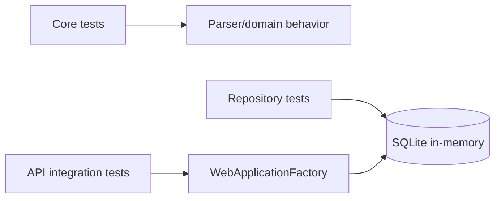

# Testing Strategy

`Score.Tests` supplies evidence at three boundaries.

## Core tests

`ScoreCsvParserTests` checks custom CSV parsing and top-scorer behavior without any infrastructure dependency. Cases include the supplied CSV shape, quoted commas, escaped quotes, invalid scores and tied top scorers ordered alphabetically.

## Infrastructure tests

`EfScoreRepositoryTests` uses SQLite in-memory. SQLite is intentionally used rather than EF Core's non-relational InMemory provider so LINQ translation and relational behavior are exercised.

## API tests

`ScoresApiTests` uses `WebApplicationFactory<Program>` to execute the ASP.NET Core HTTP pipeline. SQL Server is replaced with SQLite in-memory, while JWT authentication is replaced by a deterministic test authentication scheme. Authorization policy itself remains active, allowing tests to verify 401, 403 and successful authenticated requests.

